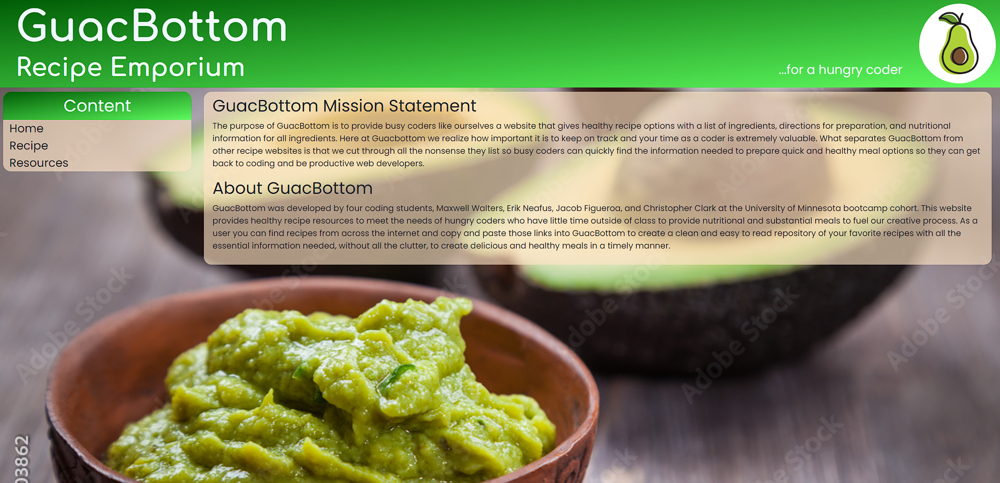

# GuacBottom Recipe Emporium Website:

## About GuacBottom:

The purpose of GuacBottom is to provide busy coders like ourselves a website that gives healthy recipe options with a list of ingredients, directions for preparation, and nutritional information for all ingredients. Here at Guacbottom we realize how important it is to keep on track and your time as a coder is extremely valuable. What separates GuacBottom from other recipe websites is that we cut through all the nonsense they list so busy coders can quickly find the information needed to prepare quick and healthy meal options so they can get back to coding and be productive web developers.

## Group Project Goal:

The Goal of this project is to work with a group of other developers to create a website which will utilize a different website's API to pull data from, then populate that data into our project's website. This website will also use another new technology, have at least 2 HTML pages with semantically correct HTML, create a form where the user provides some information that gets stored in LocalStorage, use Bootstrap along with custom CSS and be responsive at a mobile and desktop breakpoint. In addition, this website will run in the browser and will dynamically update the HTML and CSS through JavaScript powered by jQuery.

## Team Members:

* **Maxwell Walters**
* **Erik Neafus**
* **Jacob Figueroa**
* **Christopher Clark**

### Here is a link to the final version of the GuacBottom Recipe Emporium website.

[Click here to see the GuacBottom Recipe Emporium website.](https://odetothecode.github.io/GuacBottom/)

