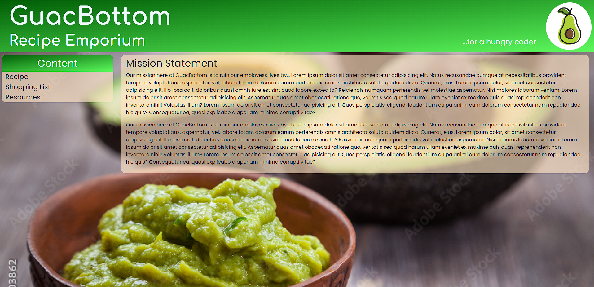

# Recipe Web Site

## Group Project Goal:

The Goal of this project is to work with a group of other developers to create a website which will utilize a different websites API to pull data from, then populates that data into our projects website. The website will also use another new technology, have at least 2 HTML pages with semantically correct HTML, use Bootstrap along with custom CSS and be responsive at a mobile and desktop breakpoint.   This website will run in the browser and will dynamically update the HTML and CSS throught JavaScript. 

## Team Members:

* **Maxwell Walters**
* **Erik Neafus**
* **Jacob Figueroa**
* **Christopher Clark**

### Here is a link to the final version of our group project website.

[Click here to see our group project website.](https://odetothecode.github.io/GuacBottom/)

Project Requirements
You will build a web application, the subject is yours to choose, that meets the following criteria:

You will decide on an MVP (Minimal Viable Product) and clear it with the instructors before starting
It uses semantically correct HTML and has at least 2 html pages 
It uses Bootstrap (or other CSS Framework, or none at all), along with custom CSS you write. The app must be responsive at a mobile and a desktop breakpoint.
jQuery recommended, not mandatory; but Javascript must be used 
Must have at least one form where the user provides some kind of information 
LocalStorage must be used for something
Must use at least one API for data 
Must use at least one new technology, library, etc...
All code must clean and well-organized, with good file structure 
No obvious bugs, no errors in dev console
Frequent code commits by all members 
The README file will be well-organized and have:
Project description
Team members 
Screen shot 
Link to deployed version on Github Pages 
Final code must be deployed to Github Pages 
Only one repo needs to be managed per group. 

The presentation:
It will last about 10-15 minutes
It will be accompanied by a Google Slides doc 
Every group member will have a turn at speaking
You will discuss:
Your initial idea and the MVP you decided on
Your tech stack
Challenges you faced 
Things which went right; things you struggled with 
Ideas for expansion
Quick demo of the working site

